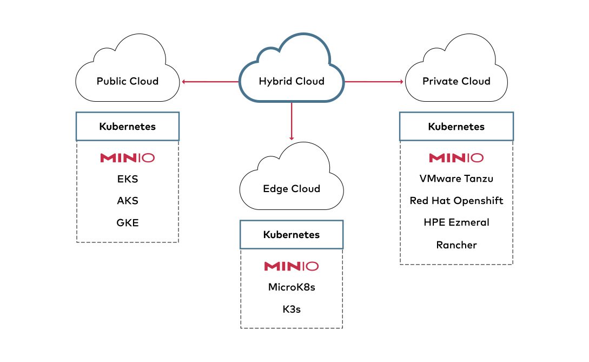

### FRANCISCO JAIME DA SILVA

## Spark com Min.io

## Projeto de Engenharia de dados com Spark e Data lake Min.io

__*Foi Criando um Data Lake como objetivo ser o repositório de dados.*__

O projeto consiste em efetuar o upload dos dados para a zona de pouso realizar limpeza e preprocessamento dos dados, utilizar o spark para limpar e formatar os dados deixando-os no formato mais apropriado para aplicação de análises. Realizar agregações nos dados e transportar para a zona de serviços, para serem explorados pelos cientistas e analista de dados.

---

### Etapas do Projeto

1. Foi Criado um datalake  utilizando o Min.io intalado localmente com estruta abaixo
<ul>
  <li>Bancket(ingestao) - Como zona de pouso ou landing zone(dados em formato bruto)</li>
  <li>Bancket(processamento - Como zona de processamento ou processing zone(dados pre-processados)</li>
  <li>Bancket(servico) - Como zona de serviços ou cureted zone(Dados limpos prontos para análises)</li>  
</ul> 
2. Foi realizado o upload dos arquivos de dados na zona de pouso(ingestao), extraídos do kaggle

<ul>
  <li>T201601PDPI+BNFT.csv</li>
  <li>T201602PDPI+BNFT.csv</li>
  <li>T201603PDPI+BNFT.csv</li>
  <li>T201604PDPI+BNFT.csv</li> 
  <li>T201605PDPI+BNFT.csv</li>  
  <li>T201606PDPI+BNFT.csv</li>
  <li>T201607PDPI+BNFT.csv</li>
  <li>T201608PDPI+BNFT.csv</li>
  <li>T201609PDPI+BNFT.csv</li>
  <li>T201610PDPI+BNFT.csv</li>
  <li>T201611PDPI+BNFT.csv</li>
  <li>T201612PDPI+BNFT.csv</li>   
</ul> 
 
3. Foram realizadas a limpeza, pre-processamento e conversão para o formato parquet, visando melhorar a performance nas proximas etapas do processo. O resultado(df-formatado.parquet) desse processo foi gravado na nona de processamento.      

4. Foi realiada a leitura dos dado em formato parquet e criada a view Dados_Sql para permitir exploração dos dados via SQL.
5. Foi aplicada a agregação dos dados da view Dados_Sql e disonibilização na zone de serviços no fromato parquet(df-Dados-Agregados.parquet) para futuras análises por parte dos cientistas e nalista de dados. 

5. Foi utiizado o notebook abaixo para realiza o processamento dos dados.
<https://github.com/jaimesilvads/Spark_min.io/blob/main/SparckComMin_Io.ipynb>.

